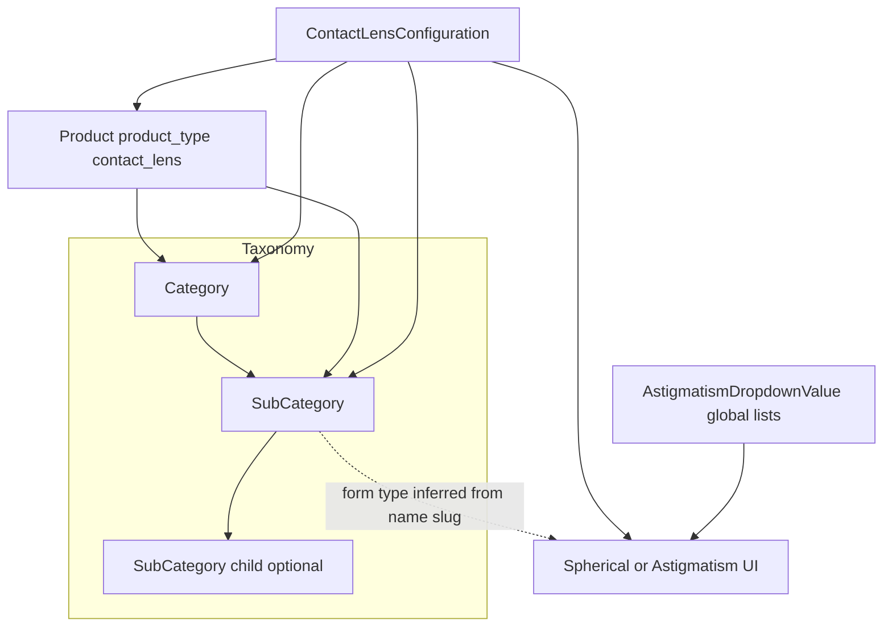

# Contact lenses: domain model and how everything ties to a product

This document describes how **categories**, **subcategories** (including nested “sub-subcategories”), **products**, **spherical vs astigmatism** flows, **configurations**, and **cart/order** data fit together in OptyShop. Use it when re-implementing the shop on a new site or API.

For endpoint payloads and examples, see also [`CONTACT_LENS_FORMS_DOCUMENTATION.md`](./CONTACT_LENS_FORMS_DOCUMENTATION.md) and [`PRODUCT_FIELDS_DOCUMENTATION.md`](./PRODUCT_FIELDS_DOCUMENTATION.md).

---

## 1. High-level hierarchy

| Layer | Role |
|--------|------|
| **Category** | Top level (e.g. “Contact lenses”). Holds many products and subcategories. |
| **SubCategory** | Child of a category; can itself have a **parent** `SubCategory` (`parent_id`) for a second level (e.g. brand or family → **Spherical** / **Astigmatism**). |
| **Product** | Sellable SKU: `product_type = contact_lens`, linked with `category_id` and optional `sub_category_id`. |
| **ContactLensConfiguration** | Rows that define **which prescription options exist** for a given **sub-subcategory** (and optionally a **specific product**). `configuration_type` is `spherical` or `astigmatism`. |
| **AstigmatismDropdownValue** | Global catalog of allowed dropdown values (qty, base curve, diameter, power, cylinder, axis), optionally per eye. |

---

## 2. Product (`products` table)

A contact lens is still a normal **Product** with extra columns and type flag.

### Identification and placement

| Field | Meaning |
|--------|---------|
| `product_type` | Must be `contact_lens` for lens SKUs (enum: `frame`, `sunglasses`, `contact_lens`, `eye_hygiene`, `accessory`). |
| `category_id` | Required FK → `categories.id` (e.g. main “Contact lenses” category). |
| `sub_category_id` | Optional FK → `subcategories.id` (often the **leaf** sub-subcategory the product is listed under). |

### Marketing / catalog fields (typical contact lens use)

These live **on the product**; they describe the listing, not each Rx combination:

| Field | Typical use |
|--------|-------------|
| `base_curve_options`, `diameter_options`, `powers_range` | LONGTEXT; often JSON or text describing what the line supports (summary for PDP/filters). |
| `contact_lens_brand`, `contact_lens_color`, `contact_lens_material`, `contact_lens_type` | Brand, color, material, type labels. |
| `replacement_frequency`, `water_content`, `pack_type`, `size_volume` | Wear schedule, chemistry, pack sizing. |
| `can_sleep_with`, `has_uv_filter`, `is_medical_device` | Booleans for compliance/merchandising. |
| `color_images` | LONGTEXT (often JSON) for colorway images. |
| `mm_calibers` | Used where caliber-based options apply (some product lines). |

**Important:** The **selectable Rx values** shown in the configurator (per eye: qty, BC, DIA, power, and for toric: cylinder, axis) are **not** only these product columns. They come from **`ContactLensConfiguration`** + **`AstigmatismDropdownValue`** (see below).

---

## 3. Category and SubCategory

### Category (`categories`)

- Groups products at the top level.
- Related collections: `products`, `subcategories`, and also `contactLensConfigs`, `sphericalConfigs`, `astigmatismConfigs` at the category level where used.

### SubCategory (`subcategories`)

| Field | Meaning |
|--------|---------|
| `category_id` | Parent category. |
| `parent_id` | If set, this row is a **child** of another subcategory (nested navigation: category → subcategory → **sub-subcategory**). |
| `name`, `slug` | Used in URLs and, in the current backend, to infer **spherical vs astigmatism** form type from the **leaf** subcategory name (e.g. names/slugs containing spherical vs astigmatism). |

Products can point at the **deepest** subcategory that matches how you merchandise (e.g. a specific line under “Spherical”).

---

## 4. Spherical vs astigmatism (two meanings)

1. **Navigation / taxonomy**  
   Often modeled as **sibling sub-subcategories** under the same parent (e.g. “Spherical” and “Astigmatism” under a brand or family). The **slug** (e.g. `spherical`, `astigmatismo`, `astigmatism`) ties the user to the right form.

2. **Data / configuration**  
   Stored as `ContactLensConfiguration.configuration_type`:

   - `spherical` — Qty, base curve, diameter, **power** (per eye). No cylinder/axis on the configuration row for that type.
   - `astigmatism` — Same base fields plus **cylinder** and **axis** (per eye), plus power.

The website flow is: user is on a **product** that belongs to contact lenses → user picks or lands on a **leaf subcategory** → frontend calls **`GET /api/contact-lens-forms/config/:sub_category_id`** → backend returns `formType: "spherical" | "astigmatism"` and built dropdowns.

---

## 5. ContactLensConfiguration (main configurator source)

Table: `contact_lens_configurations` (Prisma model `ContactLensConfiguration`).

| Field | Purpose |
|--------|---------|
| `configuration_type` | `spherical` \| `astigmatism` (enum `ContactLensConfigType`). |
| `product_id` | Optional. If set, this row can be scoped to **one product**; if null, interpreted in context of subcategory/category only (depends on API filters). |
| `sub_category_id` | Optional FK — ties options to a **subcategory** (usually the leaf sub-subcategory). |
| `category_id` | Optional FK for broader scoping. |
| `right_*` / `left_*` | LONGTEXT fields storing **JSON arrays** (or serialized lists) of allowed values: `qty`, `base_curve`, `diameter`, `power`; for astigmatism also `cylinder`, `axis`. |
| `name`, `display_name`, `slug`, `sku` | Admin/display identifiers for the configuration “row”. |
| `price`, `unit_prices`, `available_units`, `unit_images` | Per-pack or per-unit pricing and imagery where used. |
| `lens_type`, `spherical_lens_type` | Optional labels. |
| Stock fields | `stock_quantity`, `stock_status`, etc., when the config row acts like a sellable variant. |

**Relation to one product:**  
- A product has **many** `contactLensConfigs` (Prisma: `Product.contactLensConfigs`).  
- Filtering configs by `product_id` and/or `sub_category_id` + `configuration_type` is how you get the exact matrix for **that** PDP.

---

## 6. Legacy / parallel tables: SphericalConfiguration & AstigmatismConfiguration

The schema also includes:

- `spherical_configurations` — `SphericalConfiguration`: requires `sub_category_id`; optional `productId`, `category_id`; same style of `right_*` / `left_*` LONGTEXT fields for spherical parameters.
- `astigmatism_configurations` — `AstigmatismConfiguration`: same pattern plus `right_cylinder`, `right_axis`, `left_cylinder`, `left_axis`.

Some admin or historical flows may still use these. The **contact-lens-forms** public API described in `CONTACT_LENS_FORMS_DOCUMENTATION.md` is built around **`ContactLensConfiguration`** and **`AstigmatismDropdownValue`**. For a **new** implementation, treat **`ContactLensConfiguration` as the canonical configurator model** unless you confirm your deployment still reads the older tables.

---

## 7. AstigmatismDropdownValue (global dropdown catalog)

Table: `astigmatism_dropdown_values`.

| Field | Purpose |
|--------|---------|
| `field_type` | `qty`, `base_curve`, `diameter`, `power`, `cylinder`, `axis` (enum `AstigmatismFieldType`). |
| `value` / `label` | Stored value and optional display label. |
| `eye_type` | `left`, `right`, `both`, or null (enum `AstigmatismEyeType`). |

The backend merges these with data from `ContactLensConfiguration` when building the public form (e.g. spherical config aggregates powers from config rows and uses dropdown rows for qty/BC/DIA).

---

## 8. Cart and order: what is stored per line item

When the user submits the contact lens form, selected parameters are persisted on **`cart_items`** and copied to **`order_items`** (Prisma: `CartItem`, `OrderItem`).

### Structured columns (both eyes)

| Column | Meaning |
|--------|---------|
| `contact_lens_right_qty`, `contact_lens_left_qty` | Quantities (int). |
| `contact_lens_right_base_curve`, `contact_lens_left_base_curve` | Decimal(5,2). |
| `contact_lens_right_diameter`, `contact_lens_left_diameter` | Decimal(5,2). |
| `contact_lens_right_power`, `contact_lens_left_power` | Decimal(5,2). |

### Astigmatism extras

Cylinder and axis are often stored in **`customization`** (LONGTEXT JSON string) on cart/order items, in addition to or alongside the decimals above—see checkout handler behavior in the backend.

---

## 9. API cheat sheet (new frontend)

Base path: `/api` (prepend your server URL).

| Goal | Method & path |
|------|----------------|
| List products in contact section | `GET /products/section/contact-lenses` |
| Product by slug | `GET /products/slug/:slug` |
| Categories / subcategories tree | `GET /categories?includeSubcategories=true` etc. |
| Subcategories by category | `GET /subcategories/by-category/:categoryId` |
| Aggregated options for a leaf subcategory | `GET /subcategories/:id/contact-lens-options` or `GET /subcategories/slug/:slug/contact-lens-options` |
| Build spherical/astigmatism form | `GET /contact-lens-forms/config/:sub_category_id` |
| List configs (optional `product_id`) | `GET /contact-lens-forms/spherical?sub_category_id=…&product_id=…` |
| | `GET /contact-lens-forms/astigmatism?…` |
| Dropdown values | `GET /contact-lens-forms/astigmatism/dropdown-values?field_type=…&eye_type=…` |
| Add configured lens to cart | `POST /contact-lens-forms/checkout` (auth) |

Route constants mirroring this exist in the frontend: `optyshop-frontend/src/config/apiRoutes.ts` (`SUBCATEGORIES.CONTACT_LENS_*`, `CONTACT_LENS_FORMS`).

---

## 10. End-to-end mental model (one product)

1. **Product** row: `product_type = contact_lens`, `category_id` + optional `sub_category_id`, plus descriptive fields (brand, material, pack info, etc.).  
2. **Leaf subcategory** (often `parent_id` set): determines **spherical vs astigmatism** UI via config endpoint.  
3. **ContactLensConfiguration** rows: define allowed **arrays** of Rx-related values; may filter by `product_id` so only relevant combinations apply to **that** SKU.  
4. **AstigmatismDropdownValue**: global lists merged into dropdowns where the API implements it.  
5. **Checkout** writes eye-specific decimals (and JSON `customization` for toric extras) onto **cart_items** / **order_items**.

---

## 11. File reference in this repo

| Topic | File |
|--------|------|
| Prisma schema (source of truth) | `optyshop-backend/prisma/schema.prisma` |
| Forms API behavior | `optyshop-backend/controllers/contactLensFormController.js` |
| Form docs (payloads) | `optyshop-backend/CONTACT_LENS_FORMS_DOCUMENTATION.md` |
| Product column glossary | `optyshop-backend/PRODUCT_FIELDS_DOCUMENTATION.md` |
| Nested subcategory examples | `optyshop-backend/SUB_SUBCATEGORY_ROUTES.md` |

---

*Generated from the OptyShop Prisma schema and backend contact-lens form flow. Adjust if your deployment uses only a subset of tables or custom endpoints.*
