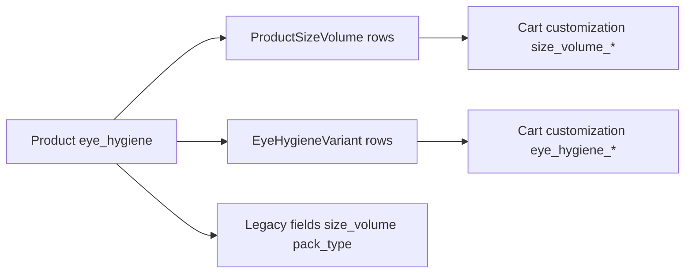

# Eye hygiene products: complete data guide (admin, API, storefront)

This document explains how **eye hygiene** products, **size/volume variants**, optional **eye hygiene variants**, **cart payloads**, and **admin workflows** work in OptyShop. Use it when porting the model to another project.

**Related code**

| Area | Location |
|------|-----------|
| Prisma schema | `prisma/schema.prisma` — `Product`, `ProductSizeVolume`, `EyeHygieneVariant`, `ProductType` enum |
| Public product + section | `controllers/productController.js` |
| Cart variant resolution | `controllers/cartController.js` (`addToCart`) |
| Admin products + size/volume CRUD | `controllers/adminController.js` |
| Eye hygiene “form options” aggregate | `controllers/productVariantController.js` — `getEyeHygieneFormOptions` |
| Unified variant resolution (optional) | `controllers/productVariantController.js` — variant id prefixes |
| Public routes | `routes/products.js`, `routes/eyeHygieneForms.js` |
| Admin routes | `routes/admin.js` |
| Storefront services | `optyshop-frontend/src/services/productsService.ts`, `eyeHygieneFormsService.ts` |
| PDP logic | `optyshop-frontend/src/pages/shop/ProductDetail.tsx` |

---

## 1. Conceptual model

Eye hygiene items are normal **`products`** with:

- **`product_type`** often set to `eye_hygiene` (enum also allows inferring from **category / subcategory** slugs containing `eye-hygiene` or names containing `eye hygiene`).
- Optional **single** merchandising fields on the product row: `size_volume`, `pack_type`, `expiry_date` (legacy / simple listings).
- Optional **many** rows per product in **`product_size_volumes`** (`ProductSizeVolume`): the **canonical** way to sell multiple sizes/packs with **per-variant price, SKU, stock, image**.

A second, simpler table **`eye_hygiene_variants`** (`EyeHygieneVariant`) exists for **named variants** (label + price + image). The **cart** supports both:

- `variant_type: "size_volume"` with `selected_variant_id: "size_volume_{id}"` → resolves to `ProductSizeVolume`.
- `variant_type: "eye_hygiene"` with `selected_variant_id: "eye_hygiene_{id}"` → resolves to `EyeHygieneVariant`.

The storefront (`ProductDetail`) may show **both** patterns: cards fed from the eye-hygiene variants endpoint and/or selectors driven by **`sizeVolumeVariants`** embedded in the product payload.



---

## 2. Database: `products` (eye-relevant columns)

| Column | Type | Purpose |
|--------|------|---------|
| `product_type` | enum | Set to `eye_hygiene` for hygiene SKUs (with category checks in API). |
| `category_id` | FK | Usually points at an “Eye hygiene” (or similarly named) category. |
| `sub_category_id` | FK | Optional; slugs used with category to detect eye hygiene in APIs. |
| `size_volume` | VARCHAR(50) | **Single** default/summary size (e.g. `10ml`) when no variant rows are used. |
| `pack_type` | VARCHAR(50) | **Single** pack label (e.g. `Single`, `Pack of 2`). |
| `expiry_date` | DateTime | Optional product-level expiry (variant-level also exists on `ProductSizeVolume`). |

Detection pattern in backend (simplified): treat as eye hygiene if **category or subcategory** name/slug matches `eye hygiene` / `eye-hygiene`, or `product_type === 'eye_hygiene'`, or product has hygiene-related fields / variants.

---

## 3. Database: `product_size_volumes` (`ProductSizeVolume`)

**Table map:** `product_size_volumes` (Prisma model `ProductSizeVolume`).

| Column | Purpose |
|--------|---------|
| `id` | Primary key (used in cart as `size_volume_{id}`). |
| `product_id` | FK → `products.id` (cascade delete). |
| `size_volume` | Required string, e.g. `5ml`, `100ml`. |
| `pack_type` | Optional string; **nullable** in DB. Together with `size_volume` forms a **unique** combination per product. |
| `price` | Variant selling price. |
| `compare_at_price` | Optional “was” price. |
| `cost_price` | Optional internal cost. |
| `stock_quantity`, `stock_status` | Per-variant inventory. |
| `sku` | Optional variant SKU. |
| `expiry_date` | Optional per-variant expiry. |
| `image_url` | Optional hero image for this size/pack. |
| `is_active`, `sort_order` | Visibility and display order. |

**Constraint:** `@@unique([product_id, size_volume, pack_type])` — you cannot duplicate the same size + pack for one product.

**Public product JSON:** When `GET /api/products/:id` (or slug) loads a product in an eye-hygiene context, the API attaches:

- `size_volume_variants` — array cloned from `sizeVolumeVariants` relation (active only, ordered by `sort_order`, `size_volume`, `pack_type`).

---

## 4. Database: `eye_hygiene_variants` (`EyeHygieneVariant`)

| Column | Purpose |
|--------|---------|
| `id` | Used in cart as `eye_hygiene_{id}`. |
| `product_id` | FK → `products.id`. |
| `name` | Display name (e.g. `10ml — twin pack`). **No separate `size_volume` column in schema** — encode size in `name` if needed. |
| `description` | Optional text. |
| `price` | Variant price. |
| `image_url` | Optional image. |
| `is_active`, `sort_order` | Admin controls. |

**Prisma** exposes `Product.eyeHygieneVariants`. **Cart** resolves these via Prisma in `addToCart`.

**Implementation note:** A legacy **Sequelize** model `models/EyeHygieneVariant.js` still backs **`getEyeHygieneVariants` in `productVariantController.js`**. The public route **`GET /api/products/:productId/size-volume-variants`** is registered to that handler — the path says “size-volume” but the handler returns **`eye_hygiene_variants`** rows. For new work, prefer **`size_volume_variants` on the product response** (Prisma `ProductSizeVolume`) or add a dedicated public endpoint for `ProductSizeVolume` if you need a clean separation.

---

## 5. Admin: managing products and variants

**Auth:** Admin/staff JWT on `/api/admin/*` (see `routes/admin.js`).

### 5.1 Eye hygiene product list

- `GET /api/admin/products/section/eye-hygiene`  
  Lists products with `product_type` eye_hygiene (same helper as public section filter).

### 5.2 Create / update product (including nested size/volume rows)

Admin **`POST /api/admin/products`** and **`PUT /api/admin/products/:id`** accept:

- Normal product fields, including `size_volume`, `pack_type`, `expiry_date`.
- **`sizeVolumeVariants`**: JSON array (or JSON string) of variant objects. On create, the controller loops and **`prisma.productSizeVolume.create`** for each. On update, it can **sync**: delete missing ids, update existing, create new (see `adminController.js` around `sizeVolumeVariantsData`).

Typical variant object shape for bulk embed:

```json
{
  "size_volume": "30ml",
  "pack_type": "Single",
  "price": 12.99,
  "compare_at_price": 15.99,
  "stock_quantity": 100,
  "stock_status": "in_stock",
  "sku": "EH-30-1",
  "image_url": "https://...",
  "is_active": true,
  "sort_order": 0
}
```

### 5.3 Dedicated size/volume variant CRUD

| Action | Method & path |
|--------|----------------|
| List | `GET /api/admin/products/:productId/size-volume-variants` |
| One | `GET /api/admin/products/:productId/size-volume-variants/:variantId` |
| Create | `POST /api/admin/products/:productId/size-volume-variants` — **requires** `size_volume`, `price` |
| Update | `PUT /api/admin/products/:productId/size-volume-variants/:variantId` |
| Delete | `DELETE /api/admin/products/:productId/size-volume-variants/:variantId` |
| Bulk replace | `PUT /api/admin/products/:productId/size-volume-variants/bulk` — body `{ "variants": [ ... ] }` |

### 5.4 Eye hygiene variant CRUD (named variants)

| Action | Method & path |
|--------|----------------|
| Create | `POST /api/admin/eye-hygiene-variants` — body: `product_id`, `name`, `description`, `price`, `image_url`, `sort_order` |
| Update | `PUT /api/admin/eye-hygiene-variants/:id` |
| Delete | `DELETE /api/admin/eye-hygiene-variants/:id` |
| List by product | `GET /api/admin/products/:productId/eye-hygiene-variants` |

*(Same operations are duplicated under `routes/admin/productVariantRoutes.js` with `protect` + `authorize('admin')` in some setups — align with your mounted router.)*

---

## 6. Public API (storefront / headless)

| Endpoint | Purpose |
|----------|---------|
| `GET /api/products/section/eye-hygiene` | Paginated list; `product_type=eye_hygiene`. List responses add `size_volume`, `pack_type`, `expiry_date` when category matches eye hygiene. **Variant arrays may be omitted on list** for performance. |
| `GET /api/products/:id` | Full product; for eye hygiene, includes **`size_volume_variants`** (from `ProductSizeVolume`). |
| `GET /api/products/slug/:slug` | Same shaping as by id. |
| `GET /api/products/:id/size-volume-variants` | **Currently** wired to Sequelize **`EyeHygieneVariant`** list (see §4). Treat as “optional named variants” unless you change the route. |
| `GET /api/eye-hygiene-forms/options?sub_category_id=` | Aggregated catalog: scans products in category **name** `'Eye Hygiene'` (hardcoded in controller), returns nested variants and `common_fields.sizes` / `pack_types`. |

**`getEyeHygieneFormOptions` response shape (conceptual):**

- `products[]`: each with `variants[]` built from **`sizeVolumeVariants`** (not `EyeHygieneVariant`).
- `common_fields.sizes`, `common_fields.pack_types`, `common_fields.sub_categories`.

If your production category name differs from `"Eye Hygiene"`, this endpoint may return empty until aligned.

---

## 7. Storefront (frontend) behavior

### 7.1 Services

- **`productsService.ts`**  
  - Types: `SizeVolumeVariant`, `EyeHygieneVariant`, `Product.size_volume_variants`.  
  - `getProductEyeHygieneVariants(id)` → calls **`GET /products/:id/size-volume-variants`** (same URL as above — know what the backend actually returns).

- **`eyeHygieneFormsService.ts`**  
  - `getEyeHygieneOptions(subCategoryId)` → `/eye-hygiene-forms/options`.  
  - `getSizeVolumeVariants(productId)` → **same** `GET /products/:id/size-volume-variants` — expects `{ data: { variants } }` shaped like **`ProductSizeVolume`** in comments; **verify against live API** because the backend handler may return Sequelize eye-hygiene rows.

### 7.2 Product detail page (`ProductDetail.tsx`)

- **`isEyeHygiene`**: true if `product_type === 'eye_hygiene'`, category/subcategory slugs contain `eye-hygiene`, or product has `size_volume` / `pack_type` / `expiry_date`, or has `sizeVolumeVariants` / `size_volume_variants`.

- **Price priority (simplified):** selected **eye hygiene variant** price overrides **size/volume variant** price, which overrides color-based price, then base product price.

- **Two data paths**  
  1. **`product.sizeVolumeVariants` / `size_volume_variants`** on the main product fetch — drives dropdowns / matrix UI for size + pack + variant image (`productImage.ts` helpers use `size_volume` string for fallbacks).  
  2. **`getProductEyeHygieneVariants`** — renders **variant cards** when the API returns rows.

- **Add to cart (eye hygiene):** builds `customization` including:
  - For size/volume path: `size_volume`, `pack_type`, `size_volume_variant_id`, and/or `selected_variant_id` + `variant_type: "size_volume"`.
  - For named variant path: `eye_hygiene_variant_id`, image fields, and/or `selected_variant_id` + `variant_type: "eye_hygiene"`.

Exact payload composition is in `ProductDetail.tsx` where it calls the cart API (search for `isEyeHygiene` and `addToCart`).

### 7.3 Cart API contract (backend)

`POST /api/cart/items` accepts (among others):

```text
selected_variant_id   e.g. "size_volume_12" or "eye_hygiene_3"
variant_type          "size_volume" | "eye_hygiene" | "mm_caliber"
product_id
quantity
```

Server loads `ProductSizeVolume` / `EyeHygieneVariant` from Prisma, computes **variant price**, and stores a **`customization`** JSON on the cart line, including:

- **Size/volume:** `size_volume_variant_id`, `size_volume`, `pack_type`, `sku`, `size_volume_image_url`, etc.  
- **Eye hygiene variant:** `eye_hygiene_variant_id`, `eye_hygiene_image_url`.

Cart display uses `customization.eye_hygiene_image_url` or `customization.size_volume_image_url` for thumbnails when present (`cartController` formatting).

---

## 8. Implementing in a new project (checklist)

1. **Schema**  
   - `products` with `product_type`, optional `size_volume`, `pack_type`, `expiry_date`.  
   - Child table **`product_size_volumes`** with unique `(product_id, size_volume, pack_type)`.  
   - Optional **`eye_hygiene_variants`** if you need simple named SKUs.

2. **Admin**  
   - CRUD for child variants; allow bulk sync on product save.  
   - Validate unique size+pack per product.

3. **Public API**  
   - Include active variants on product detail.  
   - Use a **clearly named** route for each variant type (avoid naming `size-volume-variants` if returning a different entity).

4. **Cart**  
   - Stable external ids: `size_volume_{dbId}` and `eye_hygiene_{dbId}`.  
   - Persist chosen variant metadata in `customization` (or dedicated columns) for fulfillment.

5. **Storefront**  
   - Single source of truth for PDP: prefer **embedded** `size_volume_variants` on product GET to avoid an extra round-trip.  
   - If you use aggregate “options” endpoints, avoid hardcoded category names or make them configurable.

6. **Images**  
   - Prefer **`ProductSizeVolume.image_url`** per variant; frontend fallbacks in `productImage.ts` map common strings like `5ml`, `10ml` to static assets when no URL is set.

---

## 9. Product fields reference (eye hygiene section)

A longer column-level glossary lives in **`PRODUCT_FIELDS_DOCUMENTATION.md`** (sections **Eye Hygiene Product Fields** and related API notes). Eye hygiene uses `size_volume`, `pack_type`, `expiry_date`, and the variant tables described above.

---

*This guide reflects the OptyShop repository as of the documented controllers and Prisma schema. If you change route handlers or merge Sequelize with Prisma for `eye_hygiene_variants`, update §4 and §6 accordingly.*
